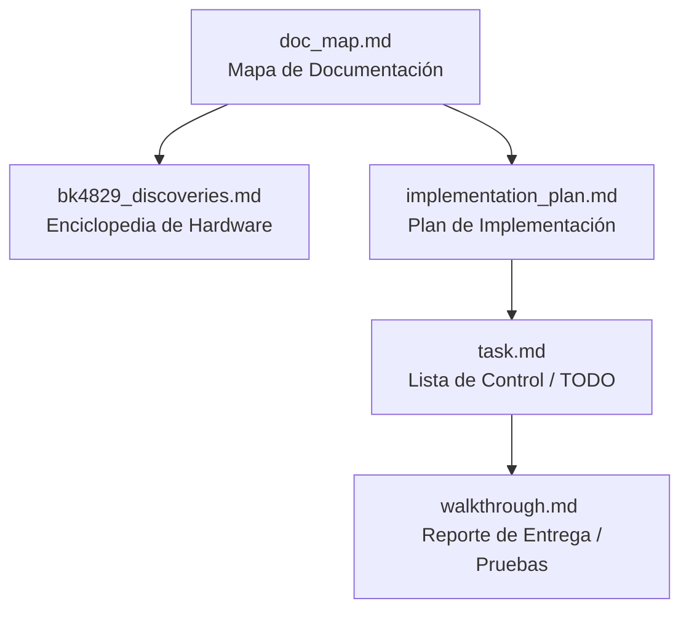

# 🗺️ Mapa de Documentación Táctica (Half-Life Firmware)

Este documento define la jerarquía, propósito y flujo de lectura de la documentación de este proyecto, optimizado tanto para **desarrolladores humanos** como para **agentes de Inteligencia Artificial (IA)**. 

---

## 📐 Jerarquía y Flujo de Lectura Recomendado

---

## 📂 Detalle de los Documentos

### 1. [Mapa de Documentación (doc_map.md)](file:///home/maxheadroom/Proyectos/BAOFENG-UV-K6-Firmware-halflife/doc_map.md)
*   **Propósito:** Definir el punto de partida y la arquitectura de la documentación.
*   **Frecuencia de actualización:** Rara vez (solo si cambia la estructura de docs).

### 2. [Descubrimientos de Hardware (bk4829_discoveries.md)](file:///home/maxheadroom/.gemini/antigravity/brain/04a61211-87fc-468c-a8a0-5c12f91ce17f/bk4829_discoveries.md)
*   **Propósito:** Biblioteca de referencia del chip RF BK4829/BK4819. Contiene registros, fórmulas de modulación analógica y configuraciones clave para que cualquier agente o humano sepa cómo hablarle al chip de radio.
*   **Frecuencia de actualización:** Cada vez que se descubre un registro nuevo del hardware.

### 3. [Plan de Implementación (implementation_plan.md)](file:///home/maxheadroom/.gemini/antigravity/brain/04a61211-87fc-468c-a8a0-5c12f91ce17f/implementation_plan.md)
*   **Propósito:** Diseño de ingeniería antes de tocar código. Explica cómo opera la nueva función (ej: Modo VRFR A), qué hooks se insertan y el flujo exacto de los datos en caliente.
*   **Frecuencia de actualización:** Antes de iniciar cualquier nueva característica en la rama.
*   **⚠️ Requiere aprobación del usuario para proceder.**

### 4. [Lista de Control (task.md)](file:///home/maxheadroom/.gemini/antigravity/brain/04a61211-87fc-468c-a8a0-5c12f91ce17f/task.md)
*   **Propósito:** La bitácora en tiempo real. Organiza el trabajo en micro-tareas específicas marcando el progreso (`[ ]` pendiente, `[/]` en desarrollo, `[x]` completado).
*   **Frecuencia de actualización:** Constante (varias veces por hora durante el desarrollo).

### 5. [Reporte de Entrega (walkthrough.md)](file:///home/maxheadroom/.gemini/antigravity/brain/04a61211-87fc-468c-a8a0-5c12f91ce17f/walkthrough.md)
*   **Propósito:** Demostrar y certificar que lo programado compila perfectamente y detallar la guía paso a paso para que el operador de radio flashe y haga la prueba de campo.
*   **Frecuencia de actualización:** Al finalizar con éxito el plan de implementación.

---

## 🤖 Guía para Agentes de IA (System Prompt Integration)
Si eres una IA leyendo este repositorio para continuar el desarrollo:
1.  Lee primero [doc_map.md](file:///home/maxheadroom/Proyectos/BAOFENG-UV-K6-Firmware-halflife/doc_map.md) para ubicarte.
2.  Consulta [bk4829_discoveries.md](file:///home/maxheadroom/.gemini/antigravity/brain/04a61211-87fc-468c-a8a0-5c12f91ce17f/bk4829_discoveries.md) para comprender cómo se controla el hardware de la radio.
3.  Revisa [implementation_plan.md](file:///home/maxheadroom/.gemini/antigravity/brain/04a61211-87fc-468c-a8a0-5c12f91ce17f/implementation_plan.md) para ver en qué feature nos encontramos y cuál es su diseño propuesto.
4.  No realices cambios de código que no estén alineados con el plano aprobado.
