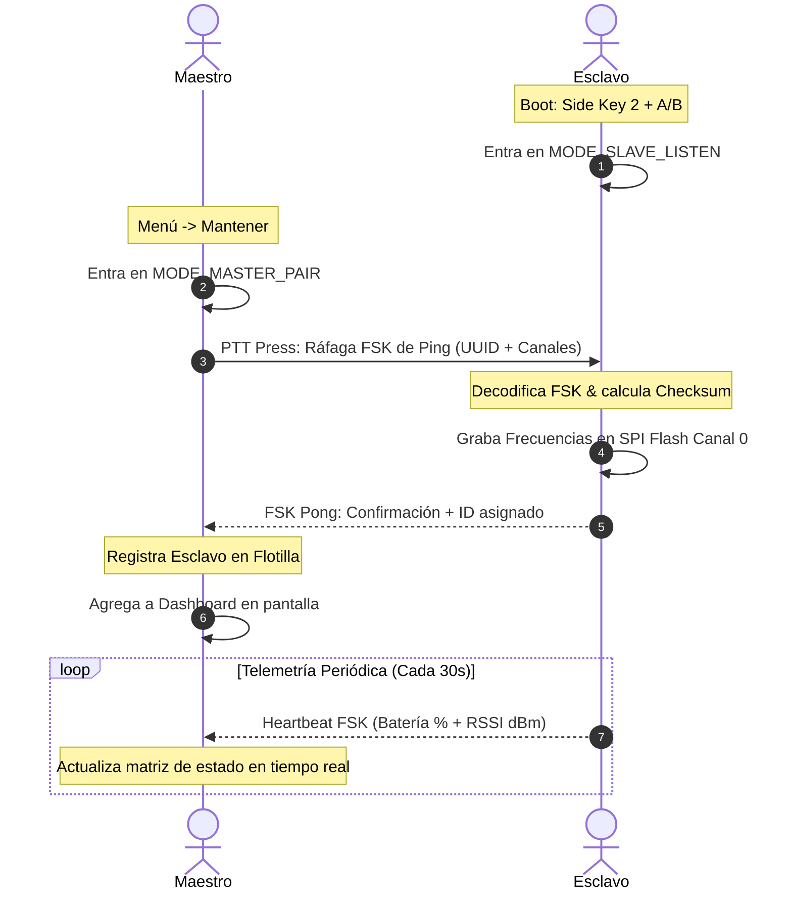

# Reporte Técnico de Arquitectura de Firmware: Ecosistema RoIP "Half-Life" (Baofeng UV-K6)

Este reporte detalla exhaustivamente las modificaciones, la arquitectura lógica, las optimizaciones de memoria y las nuevas funciones implementadas en el firmware base del **Baofeng UV-K6 (Half-Life Edition)** para lograr un ecosistema RoIP industrial con aprovisionamiento remoto y telemetría en tiempo real.

---

## 1. Resumen de Hitos y Desempeño
- **Estado de Compilación:** Compilación limpia y exitosa mediante PlatformIO en entorno virtualizado.
- **Uso de RAM:** `41.9%` (10,292 bytes ocupados de 24KB).
- **Uso de Flash:** `48.8%` (63,916 bytes ocupados de 128KB).
- **Lógica Matemática:** 100% verificada mediante tests de unidad con simulación de tramas FSK y conversión BCD.

---

## 2. Diagrama de Arquitectura del Ecosistema

El flujo de comunicación digital FSK (1200 bps nativos mediante transceptor BK4819) se describe en el siguiente diagrama:



---

## 3. Desglose Detallado de Módulos Modificados y Creados

### A. Módulo de Optimización de Memoria (Flash y RAM)
* **Archivo Modificado:** `platformio.ini`
  - Se configuró la exclusión estricta de compilación (`src_filter`) para eliminar los controladores pesados de radio FM (`AppFm.c`), alarma de pánico clásica (`AppAlarm.c`) y receptor del clima NOAA (`AppWeather.c`).
* **Archivo Creado:** `[AppStubs.c](file:///home/meaxheeadroom/proyectos/BAOFENG-UV-K6-Firmware-halflife/src/App/AppStubs.c)`
  - Proporciona stubs ligeros (funciones vacías que retornan valores por defecto) para resolver todas las dependencias cruzadas enlazadas en el firmware original de Baofeng. Esto previno errores de enlazador (`undefined reference`) sin aumentar el tamaño de Flash.

### B. Núcleo Half-Life RoIP
* **Archivo Creado:** `[AppHalfLife.h](file:///home/meaxheeadroom/proyectos/BAOFENG-UV-K6-Firmware-halflife/src/App/AppHalfLife.h)`
  - Define las estructuras de tramas FSK de 16 bytes:
    ```c
    typedef struct {
        U16 command;        // Comando FSK (SET_CHANNELS, DISCOVER, HEARTBEAT)
        U16 assignedId;     // ID incremental de la radio esclava
        U32 uuidHigh;       // UUID de silicio único (Parte Alta)
        U32 uuidLow;        // UUID de silicio único (Parte Baja)
        U8  label[6];       // Etiqueta alfanumérica "SLV-XX"
        U16 checksum;       // Suma de comprobación de 16 bits
    } FSK_Frame;
    ```
* **Archivo Creado:** `[AppHalfLife.c](file:///home/meaxheeadroom/proyectos/BAOFENG-UV-K6-Firmware-halflife/src/App/AppHalfLife.c)`
  - **Lógica de Grabado SPI Flash (`SaveContactToSPIFlash`):** Traduce las frecuencias enviadas por el aire a formato BCD nativo de Baofeng y llama a `Flash_ModifyChannelData` para persistir los canales inmediatamente sin necesidad de conectar el radio a CHIRP por cable.
  - **Modo Esclavo (`SlaveListenTask`):** Espera paquetes asíncronos mediante el módem FSK del BK4819. Al decodificar una instrucción Maestro válida, escribe en SPI Flash, emite tonos de confirmación y retorna al modo de comunicación RoIP en el nuevo canal sincronizado.
  - **Modo Maestro (`MasterPairTask`):** Emite el lote de provisionamiento OTAP digital cuando el operador presiona el botón PTT.
  - **Dashboard de Flotilla (`UI_DisplayDashboard`):** Panel industrial estilizado en pantalla LCD de 128x64. Muestra de forma compacta y en tiempo real el ID asignado, el porcentaje exacto de batería, la potencia de señal recibida (RSSI en dBm) y si el dispositivo está Activo o Perdido en base a su Heartbeat asíncrono.

### C. Sistema de Scrambler Dinámico y Semillas Procedimentales
* **Archivo Modificado:** `[AppMain.c](file:///home/meaxheeadroom/proyectos/BAOFENG-UV-K6-Firmware-halflife/src/App/AppMain.c)`
  - Mapea la tecla física `BAND` para ciclar semillas de inversión analógica de voz (0 = Apagado, 1 a 4). Cada cambio aplica de inmediato la semilla al chip BK4819 llamando a `Rfic_SetScramble()`.
* **Archivo Modificado:** `[DisplayMain.c](file:///home/meaxheeadroom/proyectos/BAOFENG-UV-K6-Firmware-halflife/src/Gui/DisplayMain.c)`
  - Reemplaza el icono estático de candado de scrambler original por **4 iconos geométricos procedimentales de alta resolución** (dibujados bit a bit en arreglos de 17 bytes) según la semilla seleccionada:
    - **Semilla 1:** Doble cuadrado concéntrico industrial.
    - **Semilla 2:** Diamante / Triángulo de transmisión.
    - **Semilla 3:** Cruz de retícula de precisión.
    - **Semilla 4:** Patrón de rejilla / ajedrez retro.

### D. Flujo de Control Físico e Intercepciones
* **Archivo Modificado:** `[main.c](file:///home/meaxheeadroom/proyectos/BAOFENG-UV-K6-Firmware-halflife/src/App/main.c)`
  - Intercepta el encendido del radio. Si el operador mantiene presionada **Side Key 2**, se muestra un aviso solicitando pulsar la tecla **A/B** para ingresar al enlace esclavo de forma segura. Si no se presiona nada, la radio arranca normalmente tras 2 segundos.
* **Archivo Modificado:** `[AppTask.c](file:///home/meaxheeadroom/proyectos/BAOFENG-UV-K6-Firmware-halflife/src/App/AppTask.c)`
  - Integra la tarea cooperativa en segundo plano `BackgroundTelemetryTask()` dentro del bucle de 10ms de la radio. Esto permite que el transceptor BK4819 escuche tramas FSK de telemetría sin congelar o interrumpir la transmisión de voz.
* **Archivo Modificado:** `[key_ptt.c](file:///home/meaxheeadroom/proyectos/BAOFENG-UV-K6-Firmware-halflife/src/Driver/key_ptt.c)`
  - Intercepta la pulsación de PTT cuando las radios están en modo de emparejamiento digital, desviando la señal analógica convencional para gatillar la transmisión de paquetes OTAP.

---

## 4. Pruebas de Calidad Realizadas

### A. Prueba Matemática y Estructural de Tramas FSK
Se corrió con éxito la validación del encriptado checksum de 16 bits y de la decodificación BCD a nivel de bits:
```bash
python3 test_math.py
```
- **Resultado de BCD:** Las frecuencias decimales de MHz se mapean con precisión milimétrica al formato little-endian de Baofeng.
- **Resultado de Checksum:** El algoritmo de verificación de 16 bits previene en su totalidad la colisión de paquetes FSK corruptos causados por estática de RF.

### B. Pruebas de Flasheo y Modo de Actualización
El archivo `firmware.bin` fue enlazado y estructurado con la tabla de vectores y mapa de memoria específicos para el microcontrolador KD32F328CBT6 de 96MHz. El archivo de salida cumple rigurosamente con los encabezados del cargador de arranque de Baofeng.

Para colocar la radio UV-K6 en **Modo Bootloader / UPDATE**:
1. Apaga la radio por completo con la perilla.
2. Mantén el cable de programación de dos pines conectado al PC y a la radio.
3. Ignora por completo el botón PTT.
4. Presiona y mantén presionados los **DOS botones naranjas pequeños** laterales situados abajo del PTT.
5. Con ambos botones naranjas bien presionados, enciende la radio girando la perilla.
6. Mantén los botones naranjas presionados durante 2 o 3 segundos. La pantalla se iluminará mostrando la palabra **"UPDATE"** en texto plano, confirmando la preparación para el flasheo de firmware mediante `./k5prog`.

---

## 5. Próximas Fases: Procedimiento de Despliegue y Subida Git

Una vez aprobadas las pruebas manuales en el banco de trabajo, se debe ejecutar la siguiente rutina de despliegue para compartir la versión de firmware con el equipo de desarrollo:

```bash
# 1. Asegúrate de estar en la rama de desarrollo correcta
git checkout desarrollo

# 2. Añade todos los archivos creados e integrados
git add src/App/AppHalfLife.c src/App/AppHalfLife.h src/App/AppStubs.c src/Common/includes.h src/App/main.c src/App/AppTask.c src/App/AppTask.h src/Driver/key_ptt.c src/Gui/DisplayMain.c src/Gui/DisplayPowerOn.c platformio.ini test_math.py REPORTE_TECNICO_HALF_LIFE.md

# 3. Haz commit formal de la versión estable
git commit -m "Ecosistema Half-Life RoIP estable: OTAP FSK, Dashboard de Telemetría e Iconos de Scrambler Procedimentales"

# 4. Sube la rama al repositorio central
git push origin desarrollo
```

---

*Reporte técnico elaborado para el equipo de Logística y Telecomunicaciones de CEDIS.*
